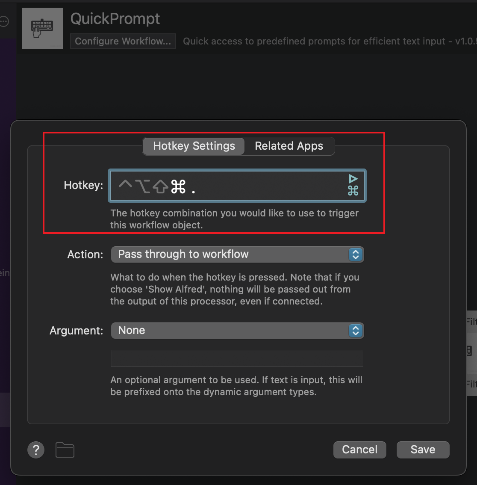

# QuickPrompt - 帮助你快速输入 prompt 的 Alfred Workflow

[English Readme](readme_en.md)

QuickPrompt 是一个提高文本输入效率的 Alfred workflow，让你能够快速调用预设的提示语（prompts）。

在使用大模型时，我们经常需要输入一些特定的提示语 (prompts) 来提高模型的输出质量。该 workflow 旨在通过快捷键 `Command + .` 快速唤出，并支持多种预设场景，让你能够快速输入这些提示语。

## 重要提示

本插件依赖于 MacOS 的 **Alfred** 软件。暂不支持 Windows 和 Linux 系统。

**Alfred** 是一款强大的 Mac 效率工具，能让你通过快捷键和关键词快速执行各种操作。

## 安装

1. 你需要先安装 Alfred 才能使用本插件。访问 [Alfred 官网](https://www.alfredapp.com/) 下载并安装 Alfred (Workflow 的运行需要 Alfred 付费版本，请自行购买或寻找资源)。

2. 从 [Release 页面](https://github.com/ZinYY/QuickPrompt_AlfredWorkflow/releases) 下载 `QuickPrompt.alfredworkflow` 并双击安装。

3. 打开 `Workflows -> QuickPrompt -> Hotkey`, 设置快捷键 (推荐 `Command + .`)

## 使用方法

1. 按下 `Command + .` 呼出 QuickPrompt
2. 输入关键词搜索需要的提示语（支持中英文搜索）
3. 选择所需提示语，系统会自动将其插入到文本的开始位置

## 功能特点

-   全局快捷键 `Command + .` 快速唤起
-   支持多种预设场景：

    -   🔠⇨🔠 英文学术写作润色
    -   📚 Bibtex 引用格式添加
    -   🔠⇨🀄️ 英译中（学术翻译）
    -   ... ...

-   自动缓存上一次的搜索结果

-   在安装 workflow 后，你可以在 Alfred 中通过修改 `Workflows -> QuickPrompt -> Script Filter` 来自定义 prompt。

## 搜索提示

-   可使用拼音或英文搜索，如：
    -   "polish" - 查找润色相关提示语
    -   "bibtex" - 查找引用格式提示语
    -   "翻译" 或 "fanyi" - 查找翻译相关提示语
    -   "代码" 或 "code" - 查找代码解释提示语

## 作者

Created by Yu-Yang Qian

## 赞助:

如果你觉得脚本好用，可以请作者喝一杯咖啡：

